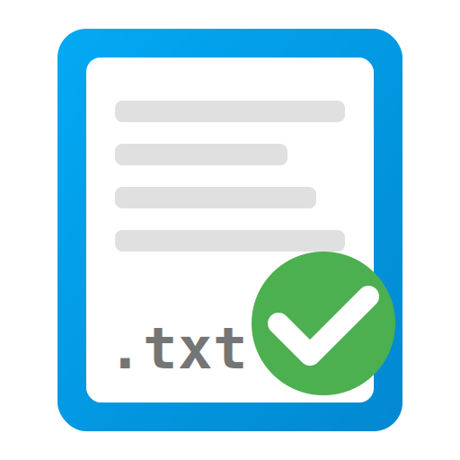

# Todo.txt for Home Assistant



A full-featured Home Assistant integration for [todo.txt](http://todotxt.org/) files. 

Manage your tasks directly from the Home Assistant To-do dashboard while keeping your data in a simple, portable, and standard-compliant text file.

## ‼️ Note
I built this with the help of Gemini. I make no guarentee that I will be responsive
to bug reports or feature requests. Pull requests will probably get more attention. 
I will try, but I struggle with my mental health, so I make no promises.

## ✨ Features

*   **Two-Way Sync**: Changes in Home Assistant update your `todo.txt` file instantly, and vice versa.
*   **Standard Compliant**: Fully supports the `todo.txt` format including:
    *   **Priorities**: `(A)`, `(B)`, `(C)`...
    *   **Contexts**: `@Phone`, `@Home`
    *   **Projects**: `+Work`, `+Garage`
    *   **Due Dates**: `due:2024-12-31`
    *   **Creation Dates**: Automatically preserved or added.
*   **Smart Sorting**: Tasks are automatically sorted by Status → Priority → Due Date → Creation Date.
*   **Filtered Lists**: Create multiple To-do lists from a single file! (e.g., a "Work" list that only shows tasks with `+Work`).
*   **Auto-Tagging**: New tasks created in a filtered list automatically get the correct tag appended.

## 🚀 Installation

### Option 1: HACS (Recommended)
[](https://my.home-assistant.io/redirect/hacs_repository/?owner=jcdietrich&repository=ha-todo.txt&category=integration)

1.  Open HACS in Home Assistant.
2.  Go to "Integrations" > Top right menu > "Custom repositories".
3.  Add this repository URL and select category **Integration**.
4.  Click **Download**.
5.  Restart Home Assistant.

### Option 2: Manual
1.  Download the `custom_components/todo_txt` folder from this repository.
2.  Copy it to your Home Assistant's `config/custom_components/` directory.
3.  Restart Home Assistant.

## ⚙️ Configuration

1.  Go to **Settings** > **Devices & Services**.
2.  Click **+ ADD INTEGRATION**.
3.  Search for **Todo.txt**.
4.  Fill in the details:
    *   **Name**: The name of your list (e.g., "My Tasks").
    *   **File Path**: The absolute path to your file (e.g., `/config/todo.txt`).
        *   *Tip: Use the [Syncthing add-on](https://github.com/hassio-addons/addon-syncthing) to sync this file with your other devices!*
    *   **Filter (Optional)**: Enter a tag like `+Work` or `@Home`.
        *   If set, this list will **only** show tasks containing this tag.
        *   New tasks added to this list will automatically have this tag added.

## 📸 Screenshots
### todo.txt


### Configuration of a list


### Dashboard view 


## 🛠️ Advanced Usage

### Syncthing Integration
This component pairs perfectly with Syncthing. 
1.  Install the Syncthing add-on.
2.  Sync your `todo.txt` from your phone/laptop to a folder in HA (e.g., `/config/todo/`).
3.  Point this integration to that path.
4.  Enjoy seamless sync across all devices!

### Multiple Lists
The integration is extremely flexible. You can add it multiple times to support different workflows:

#### Separate Files
Create independent lists pointing to different physical files:
*   **Personal**: Path: `/config/personal.txt`
*   **Work**: Path: `/config/work.txt`

#### One File, Multiple Views
Create filtered views of the same master file:
1.  **Master List**: Path: `/config/todo.txt`, Filter: *(blank)*
2.  **Work Projects**: Path: `/config/todo.txt`, Filter: `+Work`
3.  **Shopping Context**: Path: `/config/todo.txt`, Filter: `@Store`

#### Mixed Usage
You can mix and match! For example, keep your work tasks separate but filter your main personal file:
1.  **Work (File)**: Path: `/config/work_tasks.txt`
2.  **Personal (All)**: Path: `/config/personal.txt`
3.  **Personal (Groceries)**: Path: `/config/personal.txt`, Filter: `@Store`

## 🛠️ Development

If you'd like to contribute to this project, here's how to set up your development environment.

### Prerequisites
- Python 3.11+
- Dependencies: `pip install pytodotxt voluptuous`

### Running Tests
We use `unittest` for testing the core logic and integration components.

```bash
# Run all tests
python3 -m unittest discover tests

# Run tests with coverage
pip install coverage
coverage run -m unittest discover tests
coverage report -m
```

The tests mock the Home Assistant environment, so they can be run locally without a full Home Assistant installation.

## Credits
Built using the [pytodotxt](https://github.com/vonshednob/pytodotxt) library.
